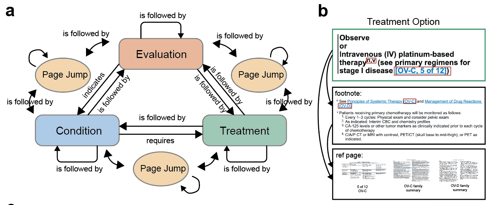
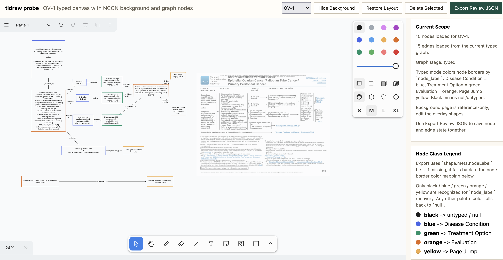

# omgs-nccn

This repository builds typed NCCN graph assets for [`omgs_engine`](https://github.com/pigudog/omgs_engine).

Licensed NCCN source files, PDFs, and extracted guideline content are not distributed in this repository.

## Physician-led typed NCCN graph review

You are free to build your own NCCN graph-RAG pipeline.

Our view is that guideline graphs and automated retrieval should support, not replace, clinician judgement. Real-world oncology decision-making often depends not only on published guideline content, but also on the latest practice changes, emerging or not-yet-published clinical trial signals, and region-specific experience. For that reason, we intentionally adopt a semi-automated approach that keeps final knowledge interpretation and decision-making in the hands of physicians.



Our framework normalises NCCN flowcharts into a typed directed graph with four core node classes—**Condition**, **Evaluation**, **Treatment**, and **Page Jump**—and a constrained set of relations, including `is followed by`, `requires`, and `indicates`. This representation preserves decision topology and path constraints instead of flattening the guideline into isolated text chunks.

Each treatment option is further linked to reviewed footnotes, principle statements, and reference pages, allowing information that is otherwise dispersed across the flowchart, annotations, and main text to be assembled into auditable, page-grounded knowledge units. These graph assets provide the substrate for topology-constrained, path-first retrieval and downstream clinician-in-the-loop decision support.



## License (this repository)

The **source code and tooling** in this repository are licensed under the [MIT License](LICENSE).

That license applies only to what is actually stored here (for example Python/JS under `src/`, `scripts/`, `review/`). It does **not** grant any rights in third-party materials such as NCCN guideline PDFs; see the next section.

## NCCN Guidelines®: permissions and disclaimer

**English**

- This repository **does not** include, redistribute, or sublicense NCCN Clinical Practice Guidelines in Oncology (NCCN Guidelines®) PDFs, full text, or NCCN-owned artwork. You must obtain licensed copies and any required permissions directly from NCCN or through your institution’s agreement.
- NCCN Guidelines® and related materials are protected by copyright and trademark (National Comprehensive Cancer Network®). Use of those materials is governed by NCCN’s terms and by your own license or subscription. This project is an engineering workspace only; **you are responsible** for compliance with NCCN’s terms, your contracts, and applicable laws (including clinical use and any commercial or research restrictions).
- Official entry points: [NCCN Guidelines by Cancer Type](https://www.nccn.org/guidelines/category_1), [Recently Updated Guidelines](https://www.nccn.org/guidelines/recently-published-guidelines). For permissions or business use, follow the contact and legal information published on [nccn.org](https://www.nccn.org/).

**中文（概要）**

- 本仓库**不包含、也不转发或再许可** NCCN 指南 PDF、全文或 NCCN 专有素材；你需要自行通过 [NCCN](https://www.nccn.org/) 或机构协议取得合法副本及所需授权。
- NCCN 指南及相关内容受版权与商标保护；使用方式以 NCCN 条款及你与 NCCN/机构的许可为准。本仓库仅为工程工具与流程，**不构成医疗建议**，也**不替代**你对许可合规与本地法规（含临床使用、商业或研究限制）的判断与责任。

## 1. Create The Environment

```bash
conda env create -f environment.yml
conda activate omgs_nccn
pip install -r requirements.txt
pip install -e .
```

Linux/macOS were validated as the primary path for the full `00-06` workflow.

For Linux production use, the recommended path for `bash scripts/00_prepare_local_inputs.sh` is NVIDIA GPU plus a CUDA-enabled `torch==2.11.0` build.

The repository pins the Torch version, but not the Linux compute flavor inside `requirements.txt`. A local CUDA build such as `2.11.0+cuXXX` still satisfies the repository pin `torch==2.11.0`.

`bash scripts/00_prepare_local_inputs.sh` auto-selects `cuda`, `mps`, or `cpu` for Marker based on the local machine.

For Linux with NVIDIA GPU, use this install order:

```bash
conda create -n omgs_nccn python=3.10.16 pip=24.3.1 setuptools=75.8.0 wheel=0.45.1 sqlite=3.47.2
conda activate omgs_nccn
# Install the CUDA-enabled torch==2.11.0 build from the official PyTorch Linux selector.
pip install -r requirements.txt
pip install -e . --no-deps
```

Official PyTorch install selector:

- [https://docs.pytorch.org/get-started/locally/](https://docs.pytorch.org/get-started/locally/)

## 2. Put Your Licensed NCCN Files Under `data/`

Place your privately licensed NCCN guideline PDF(s) under `data/ref/`.

Examples:

- `data/ref/nccn_ovarian_cancer_v3_2025.pdf`
- `data/ref/nccn_ovarian_cancer_v3_2026.pdf`

You may also use your own licensed NCCN version, file name, and disease site. This repository is not limited to ovarian cancer; the same workflow can be adapted to different tumour types as long as you provide the corresponding NCCN source file locally.

Official NCCN entry points:

- [NCCN Guidelines by Cancer Type](https://www.nccn.org/guidelines/category_1)
- [Recently Updated Guidelines](https://www.nccn.org/guidelines/recently-published-guidelines)

Licensed NCCN source files are not included in this repository.

These repository-owned, manually curated manifests are already included.
They are pipeline inputs, not generated outputs:

- `data/manifests/ov_2025_stitch_map.json`

## 3. Prepare The Local NCCN Raw Inputs

Run this from the repository root if you want the repo-owned bootstrap path:

```bash
bash scripts/00_prepare_local_inputs.sh
```

This writes:

- `data/raw/ov_2025/page_assets/`
- `data/raw/ov_2025/page_assets/page_inventory.json`
- `data/raw/ov_2025/text_extraction/22_nccn_ovarian_cancer_v3_2025/raw/primary.md`
- `data/raw/ov_2025/text_extraction/22_nccn_ovarian_cancer_v3_2025/raw/native/pages.json`

## 4. Export The API Keys You Want To Use

Phase 1, phase 2, and phase 6 are LLM-backed.

Example:

```bash
export AZURE_OPENAI_API_KEY=...
export AZURE_OPENAI_ENDPOINT=...
export AZURE_OPENAI_GPT5_DEPLOYMENT=...

export QWEN_COMPAT_API_KEY=...
export QWEN_COMPAT_BASE_URL=...
export QWEN_COMPAT_MODEL=qwen3-max
```

You can also use a repo-root `.env` file for the phase-6 wrappers.

## 5. Install The Doctor Review App

The physician review surface lives under:

- `review/tldraw_app/`

Install exact locked frontend dependencies:

```bash
cd review/tldraw_app
npm ci
cd ../..
```

## 6. Generate Page Drafts

Run phase 1 for the page you want to review:

```bash
bash scripts/01_build_phase1_drafts.sh OV-1
```

This creates the page draft graph under:

- `data/processed/ov_2025/pages/OV-1/`

It first extracts nodes, then extracts edges; edge extraction uses the nodes from the previous step.

## 7. Physician Review The Page Draft

Open the review app:

```bash
cd review/tldraw_app
npm run dev:draft -- OV-1 --host 127.0.0.1 --port 4173
```

Inside the app:

- review the draft nodes and edges
- edit the graph as needed
- use `Export Review JSON`

The exported file name is:

- `page_graph.reviewed.json`

Place that exported file at:

- `data/processed/ov_2025/pages/OV-1/page_graph.reviewed.json`

Repeat phase 1 plus physician review for each page you want to promote.

## 8. Build Page Semantics From Physician-Reviewed Pages

After physician-reviewed page graphs are in place:

```bash
bash scripts/02_build_page_semantics.sh
```

If needed, you can re-open a reviewed page for recheck:

```bash
cd review/tldraw_app
npm run dev:reviewed -- OV-1 --host 127.0.0.1 --port 4173
```

## 9. Stitch The Reviewed Global Graph

```bash
bash scripts/03_build_reviewed_global_graph.sh
```

To inspect the stitched global reviewed graph:

```bash
cd review/tldraw_app
npm run dev:global -- --host 127.0.0.1 --port 4173
```

Use this mode for graph inspection, not page-level export.

## 10. Build Rule Graph And Engine Handoff Assets

```bash
bash scripts/04_build_rule_graph.sh
bash scripts/05_build_engine_handoff_assets.sh
```

Formal graph and handoff assets are written under `data/processed/`.

Reports, freeze copies, and runtime side effects are written under `tmp/`.

If a physician changes a reviewed page graph, rerun:

```bash
bash scripts/02_build_page_semantics.sh
bash scripts/03_build_reviewed_global_graph.sh
bash scripts/04_build_rule_graph.sh
bash scripts/05_build_engine_handoff_assets.sh
```

## 11. Optional Query Smoke

Public examples are already included:

- `example/query_cases.json`
- `example/query_test.json`

Start a local Neo4j container:

```bash
docker run -d \
  --name omgs-nccn-neo4j \
  -p 7474:7474 \
  -p 7687:7687 \
  -e NEO4J_AUTH=neo4j/omgs-nccn-dev \
  neo4j:5.26
```

Then load the phase-5 CSV exports and run a smoke query:

```bash
bash scripts/06_load_neo4j_for_query_smoke.sh
bash scripts/06_run_query_smoke.sh --case-id 0
```

The loader copies the phase-5 CSV exports from `data/processed/ov_2025/query/` into the Neo4j container import directory before loading them.

The default loader settings are:

- container: `omgs-nccn-neo4j`
- password: `omgs-nccn-dev`
- import dir inside the container: `/import`

If you use a different container name or password, set:

```bash
export OMGS_NCCN_NEO4J_CONTAINER=your-container-name
export OMGS_NCCN_NEO4J_PASSWORD=your-password
```

## Included In This Snapshot

- `LICENSE`
- `src/omgs_nccn/`
- `scripts/`
- `review/tldraw_app/`
- `data/`
- `example/`
- `fig/` (README screenshot)